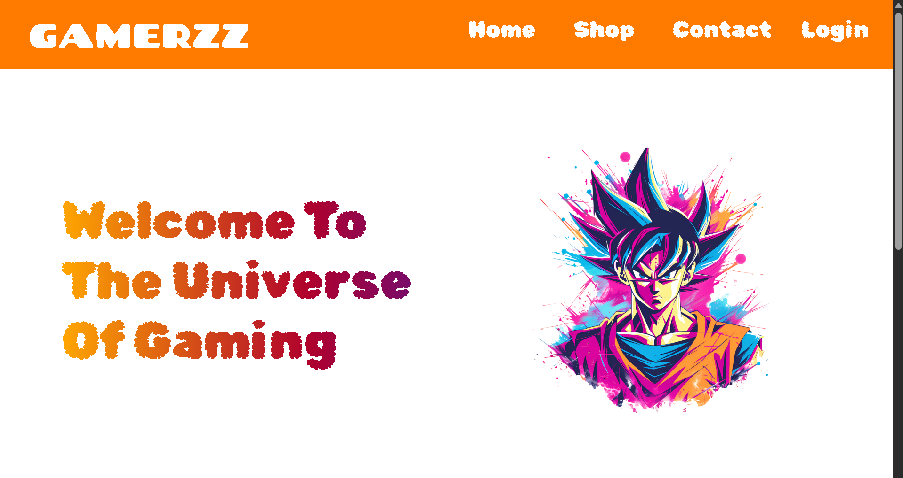
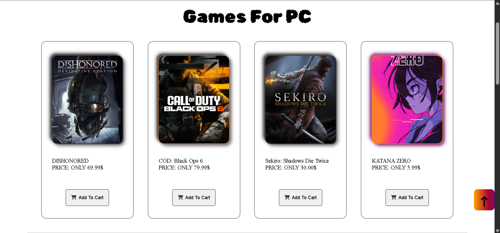
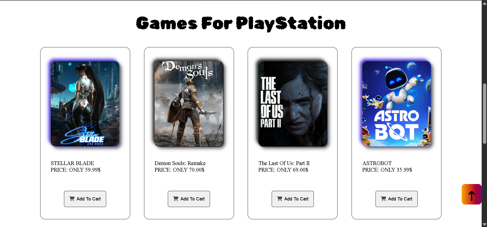

# GAMERZZ — Gaming E-Commerce Website

A multi-page gaming store front built with pure HTML, CSS, and vanilla JavaScript — featuring an animated product showcase, a shop with cart interactions, and a contact page with embedded map.

---

## screenshot





---

## Why I Built This

This was my first-semester web development project at FAST NUCES. The goal was to practice core HTML/CSS/JS fundamentals without any frameworks — building a fully responsive multi-page site from scratch, including hover animations, a sliding mobile nav menu, gradient text effects, and interactive cart feedback, all with plain vanilla JavaScript and CSS.

---

## Tech Stack

- **HTML5** — semantic multi-page structure
- **CSS3** — Flexbox layouts, media queries, custom animations, gradient text clipping
- **Vanilla JavaScript** — DOM manipulation, no libraries or frameworks
- **Font Awesome** — icons
- **Google Fonts** — Rubik Bubbles, Chango

---

## Features

- **Responsive multi-page layout** — Home, Shop, Contact, and Login pages with a shared header and collapsible mobile nav menu
- **Animated product showcase** — hover-expand product cards revealing sales stats with a slide-up gradient overlay
- **Shop with cart feedback** — "Add to cart" triggers an animated drop-down confirmation toast
- **Login / Sign-in toggle** — single form dynamically swaps between login and sign-up states via JavaScript
- **Contact page with embedded map** — Google Maps iframe alongside categorized contact info (general, orders, marketing)
- **Fully responsive breakpoints** — layout, font scaling, and simplified product view adapt down to 330px-wide screens

---

## Setup

```bash
git clone https://github.com/mubeen-ahmer/Gamerzz
cd gamerzz
```

No dependencies, no build step — it's static HTML/CSS/JS.

---

## Usage

Open `index.html` directly in any browser.

Navigate between Home, Shop, Contact, and Login using the header — on screens under 770px, use the hamburger menu instead.

---

## Project Structure

```
gamerzz/
├── assets/                # Screenshots and demo media for README
├── css/
│   ├── style.css
│   ├── shopstyle.css
│   ├── login.css
│   └── contactstyle.css
├── javascript/
│   ├── index.js
│   ├── shop.js
│   ├── login.js
│   └── contact.js
├── html/
│   ├── shop.html
│   ├── login.html
│   └── contact.html
├── images/
└── index.html
```